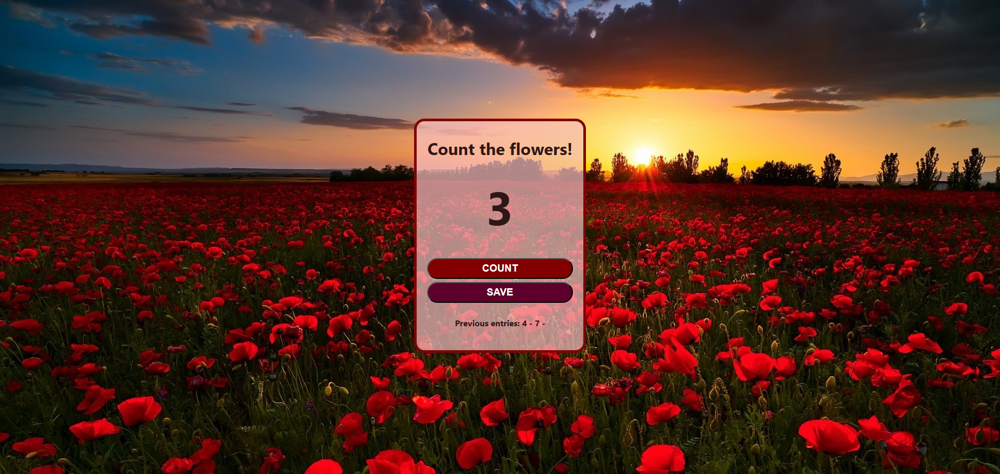

# Flower Counter App

A simple and fun counter app built with HTML, CSS, and JavaScript.

Originally based on a Scrimba project, but customized into a flower-themed counter with a redesigned background and styling.

## Technologies Used

* HTML
* CSS
* JavaScript

## Live Demo

[Flower Counter App - Live Demo](https://najya-mn.github.io/scrimba-counter-app)

## Screenshots

## Features

* Increment button
* Save entries and preview past entries
* Custom CSS theme with a red flower field and sunset background

## What I Learned

* Basic DOM manipulation
* Handling click events
* Updating UI dynamically
* Styling with background images and thematic color choices

## Acknowledgements

Based on a Scrimba's Learn JavaScript course.

